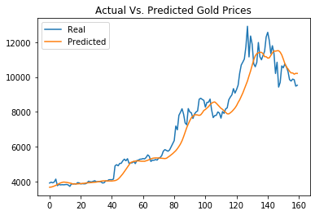

# LSTM-Stock-Predictor
Long short-term memory

## Stock Predictor based on Closing

The difference between 20 Units / 20 Epochs and 40 Units / 40 Epochs is minor. After 20 Epochs the machine learning is flat. Therefore the preferred is 30 Units and 20 Epochs. See comparison graphs below.

### Actual Vs. Predicted Gold Prices

#### 30 Units and 20 Epochs

#### 20 Units and 20 Epochs

#### 40 Units and 40 Epochs

## Stock Predictor based on Sentiment

The prediction based on Sentiment are not as close as the predictions based on previous closing prices.

### Actual Vs. Predicted Gold Prices

#### 30 Units and 20 Epochs

